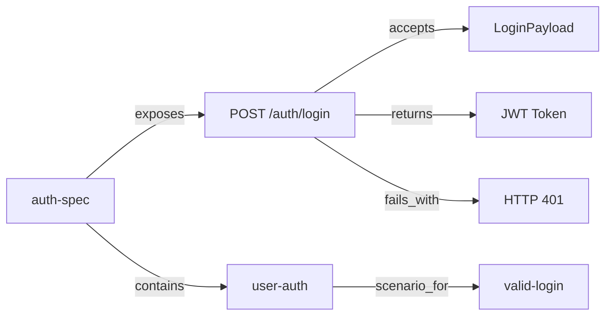

# Spec Engine — Specification-Driven Development Center of Excellence

> **From zero-to-hero: Spec-driven development that produces production-ready applications.**

[](LICENSE)
[](#)
[](#)
[](#)

---

## Table of Contents

- [Charter](#charter)
- [Why Spec-Driven Development?](#why-spec-driven-development)
- [Quick Start](#quick-start)
- [Repository Structure](#repository-structure)
- [Standards](#standards)
- [Core Concepts](#core-concepts)
- [Projects](#projects)
- [Tooling](#tooling)
- [Governance](#governance)
- [Contributing](#contributing)
- [Training](#training)
- [FAQ](#faq)

---

## Charter

The Spec Engine Center of Excellence exists to establish specification-driven development as a repeatable, measurable practice for building production-ready applications. We believe that:

- **Every line of code should trace back to a spec node**
- **Every architectural decision should be capturable as a typed graph edge**
- **Every failure during a build should become a node in the knowledge graph**
- **Production readiness is a measurable score, not a feeling**

### Scope

| In Scope | Out of Scope |
|----------|--------------|
| Spec graph methodology and tooling | Production hosting of generated apps |
| Code generation from spec graphs | Specific marketing or financial models |
| Production readiness linting | Business logic implementation |
| NebulaGraph integration | Data pipeline operations |
| Training and governance | Consulting services |

---

## Why Spec-Driven Development?

### The Problem

Traditional spec-driven development (like [OpenSpec](https://github.com/Fission-AI/OpenSpec)) is file-based. Specs live in markdown folders, relationships are implicit, and when a change is archived, its rationale is lost. Impact analysis requires reading entire documents.

### Our Solution — Graph-Native Specs

Instead of folders, specs are **graph nodes** with **typed, directed edges**:



This means:
- **Queryable**: `python3 scripts/query.py "auth-spec" --depth 3` — find all dependencies
- **Lintable**: `python3 scripts/spec-lint.py` — 14 rules catch gaps automatically
- **Traceable**: Every change is linked via `supersedes` edges — audit trail is permanent
- **Generatable**: Specs → SQLAlchemy models → FastAPI routes → React views
- **Production-checkable**: 12 rule production readiness linter scores your specs

### Comparison to OpenSpec

| Capability | OpenSpec | Spec Engine |
|-----------|----------|-------------|
| Spec storage | File folders | Graph nodes + typed edges |
| Relationships | Implicit (folder nesting) | Explicit (29 predicates) |
| Queryability | None (manual reading) | BFS/DFS traversal, path finding |
| Change history | Lost on archive | Permanent via `superseded_by` chains |
| Linting | None | 14 spec rules + 12 production rules |
| Code generation | Manual | Automated from spec subgraphs |
| Cross-project queries | Impossible | Query across all specs |
| Graph database | None | NebulaGraph with Cypher |

---

## Quick Start

### Prerequisites
- Python 3.9+
- Git
- Optional: Docker (for NebulaGraph)

```bash
# 1. Clone
git clone https://github.com/your-org/spec-engine.git
cd spec-engine

# 2. Explore the spec graph
cd tools/knowledge-graph
python3 query.py "spec-studio-platform" --depth 2

# 3. Run production lint on a spec
cd ../spec-studio/backend
pip install -r requirements.txt
python3 prod_lint.py

# 4. (Optional) Launch the web dashboard
KNOWLEDGE_PATH=../../knowledge-graph python3 main.py
# Frontend: cd ../frontend && npm install && npx vite
```

---

## Repository Structure

```
spec-engine/
│
├── README.md                       # ← You are here
├── CHARTER.md                      # CoE mission and scope
├── GOVERNANCE.md                   # Decision-making and review process
├── CONTRIBUTING.md                 # How to contribute specs and tooling
├── LICENSE                         # MIT License
│
├── standards/                      # The rules of the system
│   ├── predicate-vocabulary.md     # All 29 predicates with definitions
│   ├── node-kinds.md               # Node types: spec, req, scenario, change, etc.
│   ├── lifecycle.md                # 8-phase spec lifecycle (detailed)
│   ├── naming-conventions.md       # Slugs, directories, file organization
│   └── quality-gates.md            # Production readiness criteria
│
├── templates/                      # Reusable node templates
│   ├── spec-node.md                # Behavior contract template
│   ├── requirement-node.md         # SHALL/MUST/SHOULD template
│   ├── scenario-node.md            # Given-When-Then template
│   ├── change-node.md              # Delta exploration template
│   └── design-node.md              # Technical approach template
│
├── guides/                         # How-to documentation
│   ├── getting-started.md          # 5-minute quick start
│   ├── how-to-spec-a-project.md    # Step-by-step with examples
│   ├── lint-rules.md               # Full reference: 14 spec + 12 prod rules
│   ├── nebulagraph-setup.md        # Docker Compose + sync
│   ├── migration-from-openspec.md  # Porting existing OpenSpec projects
│   └── troubleshooting.md          # Common issues and fixes
│
├── examples/                         # Worked examples
    ├── spec-studio/                # The dashboard that specs itself
│   │   └── README.md
│   └── hello-spec/                 # Minimal example: to-do app
│       └── README.md
│
├── tools/                          # Implementation
│   ├── knowledge-graph/            # Core engine: Python scripts
│   │   ├── SCHEMA.md               # Full predicate schema
│   │   ├── graph.py                # Graph class: build, traverse, search
│   │   ├── ingest.py               # CLI: add facts as triples
│   │   ├── query.py                # CLI: query the graph
│   │   └── lint.py                 # CLI: health check
│   ├── spec-studio/                # Web dashboard
│   │   ├── backend/                # FastAPI + SQLAlchemy
│   │   │   ├── main.py             # 7 API routes + lint endpoint
│   │   │   ├── models.py           # Node, Edge, SyncRun ORM models
│   │   │   ├── database.py         # SQLite/PostgreSQL config
│   │   │   ├── sync.py             # Markdown → DB sync engine
│   │   │   └── prod_lint.py        # 12 production readiness rules
│   │   └── frontend/               # React SPA
│   │       └── src/                # Dashboard, Browser, Detail views
│   └── nebula/                     # NebulaGraph integration
│       ├── docker-compose.yaml     # GraphD + MetaD + StorageD + Studio
│       ├── nebula_init.py          # Space and schema initialization
│       └── sync_markdown_to_nebula.py
│
├── governance/                     # Process documentation
│   ├── review-process.md           # How spec reviews are conducted
│   ├── change-advisory-board.md    # Who approves spec changes
│   └── kpis.md                     # Metrics: spec coverage, lint scores
│
└── training/                       # Workshop materials
    ├── workshop-101.md             # Introduction to spec-driven dev
    ├── workshop-201.md             # Advanced predicates and graph queries
    └── workshop-301.md             # Code generation + NebulaGraph
```

---

## Standards

The complete standards are in the [`standards/`](standards/) directory. Key highlights:

### The 29 Predicates

**Universal** (identity, belief, influence):
`is_a`, `same_as`, `influences`, `depends_on`, `uses`, `builds`, `produces`,
`teaches`, `attests`, `contradicts`, `follows`, `values`, `prefers`, `rejects`

**Specification** (adapted from OpenSpec):

| Category | Predicates | Purpose |
|----------|-----------|---------|
| Contract | `exposes`, `accepts`, `returns`, `triggers`, `fails_with` | API contracts |
| Structure | `spec_of`, `scenario_for`, `contains`, `portion_of` | Spec hierarchy |
| Change | `change_for`, `adds`, `modifies`, `removes`, `archives_to` | Delta management |
| Deployment | `deploys_to`, `authenticates_via`, `touches`, `shares_schema_with` | Ops |
| Verification | `tests`, `guarantees`, `implements`, `conforms_to` | Correctness |
| Reuse | `reuses` | Pattern sharing |

### The 11 Node Kinds

`spec`, `requirement`, `scenario`, `change`, `design`, `concept`,
`task`, `tool`, `person`, `organization`, `reference`

### The 8-Phase Lifecycle

| Phase | Activity | Tooling |
|-------|----------|---------|
| 0 | Requirement intake + user questions | `clarify`, `ingest.py` |
| 0.5 | Graph inventory (query reusable patterns) | `query.py` |
| 1 | Decompose into sub-problems | `ingest.py` (adds) |
| 2 | Explore constraints, risks, unknowns | `ingest.py` (constrains) |
| 3 | Decide architecture with rationale | `supersedes`/`blocks`/`enables` |
| 4 | Write specs, requirements, scenarios | Markdown templates |
| 5 | Lint for gaps | `spec-lint.py` (14 rules) |
| 6 | Impact analysis | `query.py` (depth 3-5) |
| 7 | Implement code from specs | Manual or `gen_fastapi.py` |
| 8 | Archive with permanent change history | `archives_to` |

See [`standards/lifecycle.md`](standards/lifecycle.md) for full details.

### Production Readiness (12 Rules)

| # | Rule | Severity | What it checks |
|---|------|----------|---------------|
| P1 | LOGGING_SPECIFIED | Warning | Every endpoint has logging |
| P2 | ERROR_HANDLING_SPECIFIED | Error | Fails_with conditions handled |
| P3 | INPUT_VALIDATION_SPECIFIED | Warning | Accepts endpoints have schemas |
| P4 | HEALTH_ENDPOINT_SPECIFIED | Warning | Has /health or /readyz |
| P5 | CORS_CONFIGURED | Warning | CORS origins defined |
| P6 | TIMEOUT_SPECIFIED | Warning | Long-running ops have timeout |
| P7 | RETRY_SPECIFIED | Warning | External calls have retry |
| P8 | CONFIG_EXTERNALIZED | Warning | Env vars, not hardcoded |
| P9 | MIGRATION_STRATEGY | Warning | DB has Alembic migration |
| P10 | ENVIRONMENTS_DEFINED | Warning | Dev/staging/prod targets |
| P11 | MONITORING_SPECIFIED | Warning | Prometheus/Grafana |
| P12 | CI_CONFIGURED | Warning | GitHub Actions/CircleCI |

Scoring: 12/12 🟢 Production ready | 10-11 🟡 Ship with tracking | 7-9 🟠 Needs work | 0-6 🔴 Do not deploy

---

## Core Concepts

### Graph-Native Specs

Every spec is a markdown file with YAML frontmatter and typed edge declarations:

```markdown
---
title: Auth Specification
kind: spec
tags: [security, auth]
---
# Auth Specification

|rel:exposes| [[concepts/post-login]]
|rel:contains| [[requirements/user-auth]]
|rel:spec_of| [[tools/auth-module]]
```

Edges are declared as `|rel:PREDICATE| [[KIND/SLUG]]` — the graph engine parses these and builds a traversable graph. Edges are bidirectional: the inverse edge is automatically created by the sync engine.

### The Archive Edge Chain

Unlike OpenSpec which loses change history on archive, our graph preserves every version permanently:

```
auth-spec (v3) ←──superseded_by── add-2fa (change)
auth-spec (v2) ←──superseded_by── add-oauth (change)
auth-spec (v1) ←──superseded_by── initial-auth (change)
```

Query: "Why does auth-spec have 2FA?" → follow `superseded_by` → read the change proposal.

### Production Readiness Scoring

The production linter (`tools/spec-studio/backend/prod_lint.py`) scores any spec graph against 12 criteria. Run it before building:

```bash
cd tools/spec-studio/backend
python3 prod_lint.py
# Output: 5/12 🔴 — Not production ready
```

Add CORS, health endpoint, timeout, and environment specs to improve the score.

---

## Projects

The knowledge graph currently specs these projects:

| Project | Specs | Status |
|---------|-------|--------|
| **Spec Studio Dashboard** | Data Model, Sync Engine, API Layer, Dashboard | ✅ Built |
| **Production Readiness Linter** | 12-rule checker integrated into dashboard | ✅ Built |
| **Production Readiness Linter** | 12-rule checker integrated into dashboard | ✅ Built | — |
| **IG Scraper Platform** | Instagram data extraction with Prefect | ✅ Built | — |
| **Candle CRM** | Customer management for candle business | ✅ Built | — |

---

## Tooling

### Knowledge Graph Engine (`tools/knowledge-graph/`)

The core Python library for working with spec graphs:

```bash
# Ingest a fact
python3 ingest.py "auth-spec" "contains" "user-auth" --subject-kind specs --object-kind requirements

# Query the graph
python3 query.py "auth-spec" --depth 3
python3 query.py --path "auth-spec" "user-auth"
python3 query.py "koustubh" --depth 1 --format json

# Health check
python3 lint.py
```

### Spec Studio Dashboard (`tools/spec-studio/`)

A web interface for browsing, querying, and linting the spec graph:

- **Dashboard** (`/`): Stats, nodes by kind, production readiness score
- **Node Browser** (`/nodes`): Filterable, paginated list with kind/search/tag filters
- **Node Detail** (`/nodes/:slug`): Full metadata, rendered markdown, incoming/outgoing edges
- **API**: 7 REST endpoints + lint endpoint (Swagger at `/docs`)

### NebulaGraph Integration (`tools/nebula/`)

For large-scale graph queries and interactive visualization:

```bash
docker compose up -d
python3 nebula_init.py
python3 sync_markdown_to_nebula.py
# Studio: http://localhost:7001 (connect: graphd:9669, root/nebula)
```

Sample Cypher query:
```cypher
MATCH p=(:spec)-[:contains]->(:requirement)-[:scenario_for]->(:scenario)
WHERE id(startNode(p)) == "specs/mmm-spec"
RETURN p
```

---

## Governance

See [`GOVERNANCE.md`](GOVERNANCE.md) for full details.

### Decision-Making

- **Spec changes**: Reviewed by CoE maintainers via PR
- **New predicates**: Must be added to SCHEMA.md, graph.py INVERSE_MAP, and sync.py INVERSE_MAP
- **New node kinds**: Must be added to VALID_NODE_KINDS in models.py and PLURAL_MAP in sync.py
- **Lint rule changes**: Must not break backward compatibility without a major version bump

### Quality Gates

| Gate | Requirement | Enforced By |
|------|-------------|-------------|
| Spec compiles | All | `lint.py` — no orphan nodes, no broken edges |
| Spec complete | Changes | `spec-lint.py` — SCENARIO_FOR_REQ, EXPOSES_HAS_CONTRACT |
| Production ready | Deployment | `prod_lint.py` — score ≥ 10/12 |

---

## Contributing

See [`CONTRIBUTING.md`](CONTRIBUTING.md) for full guidelines.

### How to Contribute a Spec

1. Fork the repo
2. Add spec files to `knowledge-graph/` following the templates in `templates/`
3. Run `tools/knowledge-graph/lint.py` to verify
4. Run `tools/spec-studio/backend/prod_lint.py` to check readiness
5. Submit a PR

### How to Contribute a Tool

1. Open an issue describing the tool and its spec
2. Spec the tool using the methodology (it should spec itself)
3. Submit a PR with both the spec and implementation

---

## Training

See the [`training/`](training/) directory for workshop materials:

- **101**: Introduction to spec-driven development (30 min)
- **201**: Advanced predicates and graph queries (1 hour)
- **301**: Code generation + NebulaGraph (2 hours)

---

## FAQ

**Q: Why not just use OpenSpec directly?**

OpenSpec is file-based — specs are folders with markdown files. Our approach makes specs graph-native: every relationship is a typed edge, every change is permanently traceable, and the entire graph is queryable via BFS traversal or Cypher (via NebulaGraph). See [`guides/migration-from-openspec.md`](guides/migration-from-openspec.md).

**Q: When should I use the knowledge graph vs NebulaGraph?**

The knowledge graph (markdown files + Python scripts) is for day-to-day spec authoring, linting, and small-scale queries. NebulaGraph is for large-scale cross-project queries, interactive visualization via Studio, and Cypher-based impact analysis.

**Q: Can I use this without Hermes Agent?**

Yes. The tools are standalone Python scripts. You can author specs in any editor, run lint/query via CLI, and use the web dashboard independently. Hermes Agent integration is optional — it automates the methodology but the spec graph works without it.

**Q: How do I migrate an existing OpenSpec project?**

See [`guides/migration-from-openspec.md`](guides/migration-from-openspec.md). The key step: convert spec folders to spec nodes, requirement sections to requirement nodes, and change folders to change nodes with typed edges.

---

## License

MIT — see [LICENSE](LICENSE).

## Maintained By

Built with [Hermes Agent](https://hermes-agent.nousresearch.com).
